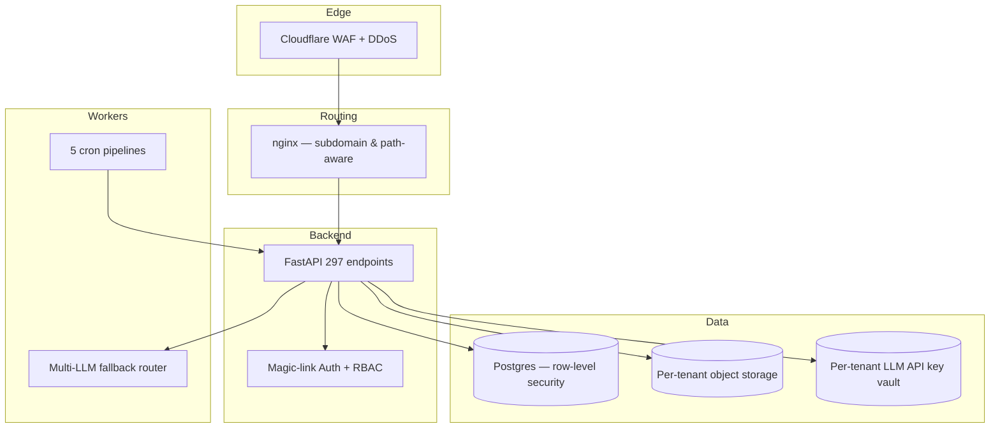

# Case 01 — PulseAgent: Multi-tenant AI Agent Platform

> **Real multi-tenant means database isolation, storage isolation, LLM key isolation, and nginx routing per tenant — not "add a tenant_id column".**

## At a glance

| Metric | Value |
|--------|-------|
| API endpoints | **297** |
| UI pages | **36** |
| Databases | **7** (per-domain isolation) |
| Docker containers | **20** |
| Paying B2B customers | **47** |
| Uptime since launch | **99.7%** |
| Built by | 1 engineer (me) over 14 months |

## The business problem

B2B customers needed AI digital employees for their own teams, but every customer had different:

- **Data sovereignty needs** — Chinese customers refused to share data with US-hosted LLMs; export businesses needed strict regional isolation.
- **LLM provider preferences** — some wanted Claude only; others Claude + DeepSeek fallback; one wanted OpenRouter as a budget governor.
- **UI customizations** — logo, theme colors, allowed tools per role.
- **Billing requirements** — Stripe for US, Alipay + WeChat Pay for China.

The naive "add `tenant_id` everywhere" model fails the moment one engineer forgets the filter — your customers see each other's data, and that's an unrecoverable trust event. We chose deeper isolation instead.

## Architecture (high level)

## Tenant isolation — 4 layers deep

| Layer | What's isolated | How |
|-------|-----------------|-----|
| 1. Network | Subdomain + path | `nginx` map directive routes `{tenant}.pulseagent.io` → tenant-scoped upstream |
| 2. Auth | Session + permissions | Magic-link token encodes `tenant_id`; middleware rejects cross-tenant requests with 403 |
| 3. Data | DB rows + objects | Postgres RLS policies on every table; S3 prefix `tenants/{id}/` enforced at API layer |
| 4. Secrets | LLM API keys | Each tenant has its own provider keys in encrypted vault — bills go to the tenant, not the platform |

## Tech stack

| Layer | Choice | Why |
|-------|--------|-----|
| Backend | FastAPI (async) | Type-safe, OpenAPI auto-docs, async-first for LLM streaming |
| Frontend | React 19 + Vite | Fast HMR, no Next.js overhead since SEO isn't needed for /app |
| DB | PostgreSQL + Drizzle on portal, raw asyncpg in backend | RLS for tenant isolation; Drizzle for type safety on portal |
| Orchestration | Docker Compose | Single-server simplicity; k8s would be overkill at 47 tenants |
| Routing | nginx | Hand-tuned config in `/root/infra/nginx/conf/` (extracted from boot-fragile area after 2026-04 incident) |
| Auth | Magic-link | Zero signup friction; no password reset support burden |
| Payments | Stripe + Alipay + WeChat Pay | Multi-region revenue collection |
| LLM | Claude + OpenAI + DeepSeek + OpenRouter | Per-tenant fallback chain |

## Key decisions

### Decision 1: Row-level security vs schema-per-tenant

**Chose RLS.** Schema-per-tenant means 47 schemas, 47 sets of migrations, and `alembic upgrade head` taking 30 minutes when adding a column. RLS keeps one schema with policies enforcing `tenant_id = current_tenant()`.

**Trade-off**: any developer who forgets `SET LOCAL app.current_tenant = $1` at session start can leak data. Mitigated with a connection wrapper that *requires* tenant context before any query runs — fails closed.

### Decision 2: Magic-link only (no password)

**Chose magic-link.** Zero password reset support tickets. Easier MFA story (email is already the second factor). Friction at signup is irrelevant for B2B (one-time event).

**Trade-off**: depends on email deliverability. Mitigated by using ZeptoMail (transactional reputation) and a fallback through Zoho.

### Decision 3: 20 containers on 1 server, not k8s

**Chose Docker Compose.** At 47 tenants and ~5K daily LLM calls, a single 8-core / 32GB VPS handles everything. k8s would add operational overhead with zero performance gain.

**Re-evaluation trigger**: when daily LLM calls exceed 50K, or when we need geographic data residency for EU customers.

## What broke and what I learned

### The `system_settings` tenant leak (2026-03)

**What happened**: `system_settings` table was created without a `tenant_id` column because it was originally for global config. Then a feature added per-tenant LLM provider routing and silently used the same table. Result: tenant A's LLM key was visible to tenant B in the admin UI.

**Discovery**: caught by integration test before production rollout, not by code review.

**Lesson** ([feedback_tenant_isolation.md](file:///Users/clarkfan/.claude/projects/-Users-clarkfan/memory/feedback_tenant_isolation.md)): **every table needs `tenant_id` from day 1, even if it "feels global"**. Globally shared data should live in a separate schema (`public.global_*`) so the absence of `tenant_id` is intentional and reviewable.

### The `deploy.sh` 60s health-check window (2026-05-14)

**What happened**: deployment script's 60-second health check timed out and reported "FAIL" while a perfectly normal alembic migration was running for 90 seconds. CI flagged red; manual check showed everything fine.

**Lesson** ([feedback_deploy_health_check_window.md](file:///Users/clarkfan/.claude/projects/-Users-clarkfan/memory/feedback_deploy_health_check_window.md)): deployments containing schema migrations need a longer health-check window (300s minimum) OR a two-phase deploy: migrate → health-check → flip traffic.

### The empty `llm_usage_logs` table (2026-04-26)

**What happened**: dashboard showed 0 LLM calls for a tenant who was clearly using the platform. Initial assumption: "low-traffic week". Actual cause: the new LLM router was bypassing the usage logger.

**Lesson** ([feedback_empty_table_is_a_bug.md](file:///Users/clarkfan/.claude/projects/-Users-clarkfan/memory/feedback_empty_table_is_a_bug.md)): **an empty audit table on a system with known traffic = writer link is broken, not "no traffic"**. Add `grep -r 'INSERT INTO llm_usage_logs'` count alerts to CI.

## Reusable patterns

If you're building multi-tenant, steal these:

1. **Fail-closed tenant context wrapper** — wrap the DB session factory so every query requires `tenant_id` in context. No way to forget.
2. **Per-tenant nginx upstream map** — keeps customer subdomains, custom logos, and custom theme colors at the proxy layer instead of bloating frontend state.
3. **Per-tenant LLM key vault** — customers bring their own keys; you don't take the markup risk on tokens. Margins are healthier and customers love seeing their own bills.
4. **Magic-link auth** — saves you 30 hours/month of password reset support.
5. **Connection-pool LLM router** — Claude first, OpenAI second, DeepSeek third, OpenRouter as cost cap. Each per-tenant configurable.

## What I'd build for you

If you need a multi-tenant SaaS architected from scratch:

- **MVP (5 APIs, 1 tenant model)**: $800, 14 days
- **Production (30 APIs, RBAC, billing, multi-LLM)**: $2,500, 30 days
- **Enterprise (100+ APIs, multi-region, monitoring, alerts)**: $5,000, 60 days

Includes: full source, Docker stack, nginx config, isolation tests, deploy runbook, 7-day bug-fix support.

Message me on Fiverr or email [fankaiwei3@gmail.com](mailto:fankaiwei3@gmail.com) with your business model — I'll tell you which tier fits.
