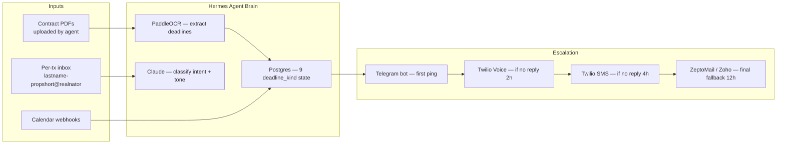

# Case 02 — Realnator: AI Digital Employee for Real Estate TC Work

> **Real estate transaction coordinators (TCs) handle 95% paperwork. AI replaces 95% of that — agents only step in for judgment calls.**

## At a glance

| Metric | Value |
|--------|-------|
| Target market | Texas real estate agents & brokerages |
| Workflow coverage | **95% of standard TC paperwork** |
| Deadline tracking types | **9 distinct `deadline_kind` enums** |
| Escalation channels | Telegram → Voice (Twilio) → SMS → Email |
| Email templates | **6 templates × 3 tone variants = 18** |
| Per-transaction inbox naming | `lastname-propshort` convention |
| Built timeline | Phase 0 (2026-04-28) → first meeting (2026-05-06) → full delivery (in progress) |

## The business problem

A Texas real estate transaction coordinator handles 20–40 transactions per month. Each transaction involves:

- Option fee deadlines (3-day window, missing one = lawsuit risk)
- Lender approval letters chasing
- Inspector / appraiser scheduling
- Title company document collection
- Earnest money receipt confirmations
- Closing date coordination across 4–6 parties

A TC costs $500–800/transaction. An agent doing 8 transactions/month spends $4K–6.4K on TC fees. **Realnator replaces 95% of the TC's mechanical work**, so agents pay $200–400/month subscription instead of $4K+ in TC fees.

The TC's remaining 5% (judgment calls — "should we ask for an extension?") still needs a human, but they handle 10x the transactions in the same time.

## Architecture

## Tech stack

| Layer | Choice | Why |
|-------|--------|-----|
| Frontend | Next.js 16 + Tailwind + GSAP | Agent dashboard needs polish (sells the product to skeptical TCs) |
| Backend | Python (FastAPI) + Hermes (Claude Agent SDK) | Same DNA as my other AI agents |
| OCR | PaddleOCR (self-hosted) | Faster + cheaper than Google Vision for contract PDFs |
| State store | PostgreSQL with `payment_records` audit trail | Every payment touch logged for legal defense |
| Email parsing | IMAP poller per-tx inbox | One inbox per transaction — clean conversation context |
| Voice | Twilio Programmable Voice | Auto-dial agent if Telegram ignored 2h |
| SMS | Twilio | Final fallback before email |
| Hosting | Hostinger VPS (`realnator-vps`, `31.97.43.57`) | Customer's own VPS, shared with their traefik proxy |

## Key decisions

### Decision 1: 9-enum `deadline_kind` vs generic task model

**Chose enum.** Real estate has exactly 9 categorical deadlines (option period, financing contingency, appraisal, inspection, title commitment, survey, HOA docs, earnest money, closing). A generic "task" model would have allowed wrong combinations (e.g., "appraisal at the contract signing"). Hard-coding the 9 enum values prevents that class of bug at the schema layer.

**Trade-off**: adding a new deadline type = migration. But Texas TREC contracts haven't added a new deadline type in 5+ years. Stability wins.

### Decision 2: Strict escalation chain (no parallel fan-out)

**Chose strict.** Telegram first → wait 2h → Voice → wait 2h → SMS → wait 4h → Email. If we fan out all channels in parallel, the agent gets buzzed 4x in 30 seconds, hates the product, and cancels.

The chain mimics how a junior TC actually does it: "I'll ping them on the platform first; if they don't see it, I'll call; if they're driving, I'll text; if they're showing a house, I'll email and they'll see it tonight."

### Decision 3: Per-transaction inbox naming

**Chose `lastname-propshort@realnator.app`** (e.g., `johnson-123main@`). Why:

- TCs forward existing email threads to this inbox to "onboard" the transaction.
- The hyphenated name is easy to read at a glance.
- Sorting by name groups all transactions for one buyer surname.
- One inbox per transaction = clean conversation context for Claude.

## What broke and what I learned

### The `socket hang up` mystery (2026-05-09)

**What happened**: After deploying Day 1 to Hostinger VPS, PDF upload returned `500 write_failed` in production but worked locally. Spent 4 hours diff-ing configs.

**Root cause**: production used HTTP/2 via Traefik; local used HTTP/1.1 via `next dev`. The PDF upload route streamed without setting `Transfer-Encoding`, which HTTP/2 rejects.

**Lesson** ([feedback_dev_prod_parity_first.md](file:///Users/clarkfan/.claude/projects/-Users-clarkfan/memory/feedback_dev_prod_parity_first.md)): **build a dev-prod mirror in week 1 of any new project**. Local Docker stack with production build + reverse proxy with TLS. `next dev` / `flask run` is not e2e.

After this, the first thing I now do on any new project is `~/realnator dev-mirror` style setup. Saves 4+ hours per project.

### The Day-1 release "three gates" failure (2026-05-09)

**What happened**: showed the agent a "ready to use" demo link before passing all 3 gates (self-test, local e2e, prod verify). PDF upload broke on the demo. Embarrassing.

**Lesson** ([feedback_release_three_gates.md](file:///Users/clarkfan/.claude/projects/-Users-clarkfan/memory/feedback_release_three_gates.md)): three gates before any client-facing link:
1. **Self-test**: hit it yourself, end-to-end, in a clean browser session.
2. **Local e2e**: full Docker stack with prod build, hit it from another machine.
3. **Prod verify**: hit prod from your phone (not your dev machine).

Skip any gate = embarrassment proportional to client seniority.

## Reusable patterns

If you're building a vertical AI digital employee, steal these:

1. **Enum domain types** over generic "task" models — domain experts know the categories; encode them.
2. **Per-conversation inbox** — one Gmail/IMAP inbox per case keeps Claude context clean.
3. **Strict escalation chain** — never parallel-fan-out alerts; mimic human behavior.
4. **Audit-trail-first schema** — `payment_records` table tracks every touch, every state transition. Legal protection is free if you build it from day 1.
5. **3-gate release** — mandatory before any link to a paying customer.

## What I'd build for you

If you need a vertical AI digital employee (real estate, legal, healthcare admin, accounting, etc.):

- **Starter (1 workflow, 1 channel)**: $1,500, 21 days
- **Premium (multi-workflow, 4-channel escalation, dashboard)**: $8,000, 60 days

Includes: full source, deployment to your VPS, voice/SMS integration, 14-day bug-fix support.

Best fit: vertical where deadlines are categorical (real estate, immigration, college admissions), where escalation matters (default = lawsuit / lost deal), and where the buyer is willing to pay $200–500/month.

Message me on Fiverr Gig #9 or email with your industry — I'll tell you whether vertical AI is the right shape for your problem.
