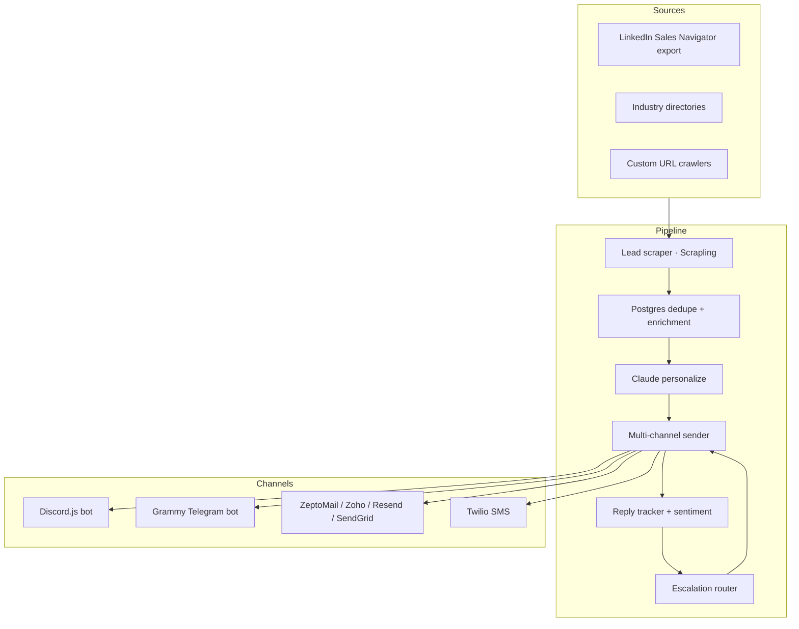

# Case 03 — B2B SDR Agent: Multi-Channel Cold Outreach Pipeline (OSS)

> **Real numbers: 1,992 leads/month, 6 cron pipelines, 4 channels with escalation chain. MIT-licensed template on GitHub.**

## At a glance

| Metric | Value |
|--------|-------|
| Production deployment | Fuyuan VPS (`170.205.30.99`) |
| Leads processed/month | **1,992** |
| Channels | Discord · Telegram · Email · SMS |
| Email providers (failover chain) | ZeptoMail · Zoho · Resend · SendGrid |
| Cron pipelines | **6** (scrape · dedupe · personalize · send · track · escalate) |
| Anti-amnesia design | Stateful agent resume across restarts |
| Open source | [iPythoning/b2b-sdr-agent-template](https://github.com/iPythoning/b2b-sdr-agent-template) |
| Live since | 2026-04 |

## The business problem

A car / equipment export business needed B2B outreach to overseas dealers, but the existing SaaS stack was bleeding cash:

- **Apollo + Outreach + Twilio combined = $1,500–2,000/month** for one user.
- **Existing tools couldn't write Chinese** — half of the target market.
- **Cold email kept getting bot-flagged** because of generic templates and aggressive ramp.

What the customer wanted:

- Stop the subscription bleed.
- Own the data + the code.
- Personalize at scale (1,500+ outbound/month, multilingual).
- Anti-spam built in (no domain blacklisting after week 2).

## Architecture



## Tech stack

| Layer | Choice | Why |
|-------|--------|-----|
| Language | Python 3.11 | Best ecosystem for scraping + LLM |
| Scraper | Scrapling | Faster than Playwright for HTML; survives anti-bot pages |
| LLM | Claude Agent SDK + OpenAI/DeepSeek fallback | Personalization quality + multilingual |
| Discord bot | Discord.js (Node sidecar) | Production-grade webhooks |
| Telegram bot | Grammy | Cleaner DSL than node-telegram-bot-api |
| Email | ZeptoMail primary + Zoho/Resend/SendGrid failover | Deliverability redundancy |
| SMS | Twilio | Only option with reliable global coverage |
| DB | PostgreSQL | Dedupe + audit trail |
| Cron | systemd timers + Anti-Amnesia v2.0 | Survives restarts mid-pipeline |

## Anti-Amnesia v2.0 — stateful pipelines

Each cron pipeline has 3 layers of resume state:

1. **Lead-level**: `lead_state` enum tracks `scraped → enriched → personalized → sent → replied → closed`.
2. **Pipeline-level**: `pipeline_run` table tracks `started_at`, `last_progress_at`, `expected_completion`.
3. **Cron-level**: each cron writes a heartbeat to Redis; if heartbeat stale > 5 min, supervisor restarts and resumes from `lead_state`.

Result: when the VPS gets `oomkilled` at 3 AM mid-pipeline, the resume picks up exactly where it left off. No double-sends, no missed leads.

## Key decisions

### Decision 1: Open-source the template (counter-intuitive)

**Chose MIT.** Why give away the secret sauce?

- The customer paid for the *first* implementation + deployment + customization. The template alone doesn't replace expertise.
- Open source attracts community contributions (bug reports, new email providers integrated by other users).
- It's a SEO + credibility magnet — `b2b-sdr-agent-template` ranks for relevant searches and feeds Fiverr / Upwork inbound.

### Decision 2: 4-provider email failover

**Chose ZeptoMail primary + 3 failover.**

- Single provider = single point of failure. ZeptoMail had a 14-day silent-bounce period in 2026 — anything sent during that window vanished.
- Failover detects bounce → switches mid-batch → resends.

### Decision 3: Halt on negative reply tone

**Chose to stop the sequence on negative sentiment.** Most SDR tools blast template sequences regardless of reply. Ours uses Claude to classify reply tone (positive / neutral / negative / out-of-office). On `negative`, the entire sequence halts and a human is paged.

This is the difference between "1,992 leads contacted" and "1,992 leads who don't hate us".

## What broke and what I learned

### The 1,992 silent `JSONDecodeError` (2026-05-10)

**What happened**: cron pipeline silently failed 1,992 times with `JSONDecodeError`. No alerts. Discovered only when monthly review showed 0 leads contacted that week.

**Root cause**: bash anti-pattern.

```bash
# BROKEN: heredoc steals stdin from the pipe
echo "$LEAD_DATA" | python3 << EOF
import sys, json
data = json.load(sys.stdin)   # sys.stdin is EOF heredoc, not lead data
EOF
```

The heredoc preempts stdin; `sys.stdin` is the heredoc content, not the piped `$LEAD_DATA`. Compounded by `2>/dev/null` swallowing the error.

**Fix**: env var or inline `-c`:

```bash
LEAD_DATA="$LEAD_DATA" python3 -c '
import os, json
data = json.loads(os.environ["LEAD_DATA"])
...
'
```

**Lesson** ([feedback_bash_heredoc_pipe_stdin.md](file:///Users/clarkfan/.claude/projects/-Users-clarkfan/memory/feedback_bash_heredoc_pipe_stdin.md)): never `echo X | python3 <<EOF`. Never combine with `2>/dev/null` — silent failure breeding ground.

### The Bytespider false-positive (2026-03-29)

**What happened**: copied an open-source bot blocker that auto-banned "Bytespider" (ByteDance's crawler). Three weeks later, organic referral traffic from TikTok Shop ad bots dropped 60%. Turns out Bytespider *also* serves the commerce engine.

**Lesson**: never copy bot-blocking rules from open-source repos without verifying *which* bots you actually want to block for *your* business. Generic blocklists destroy traffic you didn't know was valuable.

### The `git fetch` silent-fail judgment (2026-05-07)

**What happened**: I judged a routine as "silently failed" based on stale local git log. Spent 40 minutes investigating. Actually the routine had merged and pushed remotely — my local was just behind.

**Lesson** ([feedback_git_fetch_before_silent_fail_judgment.md](file:///Users/clarkfan/.claude/projects/-Users-clarkfan/memory/feedback_git_fetch_before_silent_fail_judgment.md)): always `git fetch origin` before declaring a routine has silently failed.

## Reusable patterns

If you're building cold outreach automation, steal these:

1. **Per-lead state machine** — don't trust idempotency keys alone; track lifecycle states explicitly.
2. **Tone-gated escalation** — halt on negative reply, never just-keep-sending.
3. **Multi-provider failover** — at the SMTP layer, not the application layer.
4. **Open-source the template** — sells expertise, not code.
5. **Anti-Amnesia v2.0 resume** — survive any restart mid-pipeline.

## What I'd build for you

If you need a multi-channel B2B SDR pipeline:

- **Single channel (email or Telegram), 1 lead source, 5 templates**: $400, 7 days
- **3 channels, 2 scrapers, CRM integration**: $1,200, 14 days
- **5 channels + voice, custom scrapers, full escalation chain**: $3,000, 30 days

Includes: full source, deployment to your VPS, anti-spam configuration, 14-day bug-fix support. Same architecture as the open-source template, customized to your domain (cars / B2B services / SaaS / etc.).

Message me with your target persona — I'll tell you whether B2B SDR fits your conversion economics.
