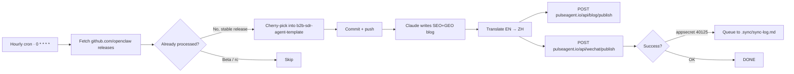

# Case 04 — OpenClaw Release Monitor & 5-Pipeline Content Engine

> **Real numbers: 55+ blog runs since 2026-05, 5 active cron pipelines, zero manual intervention.**

## At a glance

| Metric | Value |
|--------|-------|
| Active routines | **5** (OpenClaw monitor · Hermes · Browser Harness · Leaderboard · SEO weekly) |
| Successful runs since launch | **55+** |
| Trigger | Hourly cron (`0 * * * *` UTC) |
| Output channels | pulseagent.io blog · WeChat Official Account · GitHub cherry-pick |
| Languages | EN + ZH |
| Self-healing | Yes (WeChat appsecret retry queue: 19+ self-recoveries) |
| Manual intervention since 2026-04 | **Zero** |

## The business problem

PulseAgent is built on top of OpenClaw (open-source agent runtime). Every OpenClaw release triggers a cascade:

- PulseAgent SaaS must consume new features
- Blog post must announce the upgrade (SEO + GEO)
- WeChat 公众号 must publish a Chinese version
- `b2b-sdr-agent-template` repo needs to cherry-pick the upgrade

Doing this manually = 2-3 hours per release × release every 2-3 weeks = ~5 hours/month + missed releases when busy.

Goal: zero-touch. New OpenClaw release → 30 minutes later, everything's updated and announced in both languages.

## Architecture



## Tech stack

| Layer | Choice | Why |
|-------|--------|-----|
| Trigger | Claude Code routine system | Native scheduling + audit log + free re-runs |
| LLM | Claude Sonnet 4.6 | Best for long-form SEO content (1500+ words) |
| Blog API | `POST pulseagent.io/api/blog/publish` (Bearer token, UPSERT) | Idempotent re-runs |
| WeChat API | `POST pulseagent.io/api/wechat/publish` | Same Bearer auth, separate endpoint |
| Cherry-pick | git + custom Python script | Detects file conflicts, skips gracefully |
| Self-heal queue | `.sync/sync-log.md` in repo | Markdown is human-readable when things break at 3 AM |

## Key decisions

### Decision 1: Markdown queue file instead of Redis

**Chose `.sync/sync-log.md`.** When WeChat appsecret rotates and republish queue grows to 19+ items, I want to read it with `cat` — not query Redis. Markdown wins on debuggability and zero-infra cost.

### Decision 2: UPSERT blog API

**Chose UPSERT.** When routine re-runs (idempotency test), don't create duplicate posts. The blog API takes a URL slug as natural key; second run updates the same row. This makes routine testing safe — re-run 10 times, same result.

### Decision 3: Beta / rc gating

**Chose to skip beta and rc tags.** Stable releases only. Customers don't want "v2026.5.0-rc3" announced to their feed. The cron checks `tag_name` against a regex and bails on `(beta|rc|alpha)`.

### Decision 4: One-liner install for downstream users

`b2b-sdr-agent-template` ships with:

```bash
curl -fsSL https://raw.githubusercontent.com/iPythoning/b2b-sdr-agent-template/main/install.sh | bash
```

This makes the template usable in 30 seconds. The cherry-pick automation keeps it always up-to-date.

## What broke and what I learned

### The WeChat appsecret 40125 marathon (2026-05-03)

**What happened**: WeChat 公众号 `appsecret` expired (they rotate periodically). The routine kept trying, got error code 40125 ("invalid appid/appsecret"). 19+ blog posts queued in `.sync/sync-log.md`. No alert fired.

**Lesson**:
1. Heartbeat alert when `appsecret` is close to expiry (7-day warning)
2. Routine prompt **must** include "consume queue first" step — after rotation, queue doesn't auto-drain
3. Self-test in cron: try publish 1 dummy article; if 40125 → alert ops, don't fail silently

### The `git fetch` staleness trap (2026-05-07)

Same lesson as Case 03. Always `git fetch origin` before declaring a routine has silently failed. Local git log can lag behind by hours when you've been heads-down on something else.

### Cherry-pick FK target verification (2026-05-14)

**What happened**: cherry-picked a schema migration referencing `knowledge_bases` table. Target repo didn't have that table. Production `alembic` loop-restarted.

**Lesson** ([feedback_cherry_pick_fk_targets.md](file:///Users/clarkfan/.claude/projects/-Users-clarkfan/memory/feedback_cherry_pick_fk_targets.md)): every `REFERENCES <table>` in a cherry-picked schema = must `grep` target repo for `__tablename__ = "<table>"`. Missing → change to soft FK. Cross-language cherry-pick (e.g., Python SQLAlchemy → TypeScript Drizzle) doubly so.

## Reusable patterns

If you're building auto-publish or release-monitor pipelines:

1. **Markdown queue file** — human-debuggable when broken at 3 AM
2. **UPSERT API endpoints** — make re-runs safe; routine testing becomes painless
3. **Beta / rc gating** — release-feed quality control
4. **Hourly cron > daily cron** — recoverable within hours, not 24 hours
5. **Self-test inside cron** — prove the pipeline before processing real data

## What I'd build for you

If you need an auto-publish pipeline (release monitor, RSS digest, GitHub repo updates, custom URL polling):

- **Basic (1 language, 1 platform)**: $200, 5 days
- **Standard (EN + ZH, web + WeChat)**: $600, 10 days
- **Premium (multi-platform + monitoring dashboard + self-heal queue)**: $1,200, 20 days

Includes: trigger setup, LLM integration, publishing API integration, self-heal queue, deployment, alert wiring.

Message me with your content goal — I'll tell you which trigger and channel mix fits your distribution strategy.
