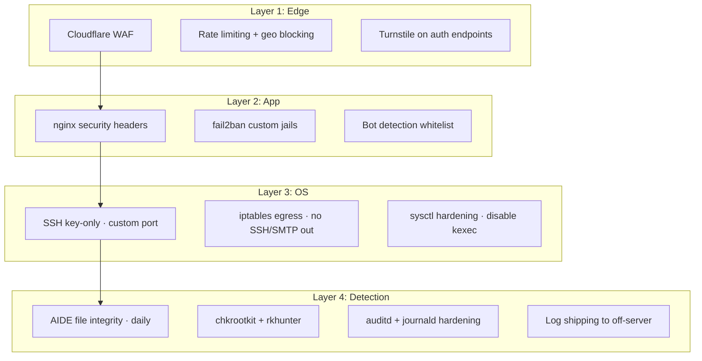

# Case 05 — VPS Hardening Playbook (Post-Intrusion Grade)

> **Real lesson: 2026-04-27 titanpuls.com intrusion → 4-layer defense playbook → 5 servers hardened → zero repeat incidents in 5+ months.**

## At a glance

| Metric | Value |
|--------|-------|
| Trigger event | titanpuls.com intrusion, abuse-suspended by hosting provider |
| Forensic findings | `libonion.so` LD_PRELOAD rootkit · `chattr +i` backdoor · WordPress plugin RCE · SSH brute-force on second host |
| Servers hardened with playbook | **5** |
| Repeat intrusions in 5+ months | **0** |
| Documentation | `~/Documents/security-hardening-2026-04-28.md` (private, NDA available) |

## The business problem

In April 2026, two of my VPS were independently compromised:

- **45.8.22.190** (`titanpuls.com`) — WordPress plugin RCE → `lighthouse` user pivot → `libonion.so` LD_PRELOAD rootkit + `chattr +i` backdoor → provider auto-suspended for outbound abuse.
- **43.x.x.x** (`tici-*`) — SSH brute-force on weak password → independent shell access.

Both rooted within 72 hours of going live. **The hosting provider's abuse-suspended both before I noticed.**

I had three choices:

1. Migrate to managed PaaS (loses cost advantage)
2. Pay external pentest ($5K–$15K per server, recurring)
3. Build a repeatable hardening playbook applied to every VPS at provisioning time

I chose #3. The result is now applied to 5 servers.

## Architecture — 4 layers of defense

## Tech stack

| Layer | Tool | Why |
|-------|------|-----|
| Edge | Cloudflare (free tier) | WAF + DDoS + rate limiting included free |
| App | nginx + fail2ban + Bytespider whitelist | Mature, well-documented, low overhead |
| OS | OpenSSH (key-only) + iptables + sysctl | Standard Linux primitives, no vendor lock-in |
| Detection | AIDE + chkrootkit + auditd | All free; covers file integrity, known rootkits, syscall audit |
| Docker | `no-new-privileges` + read-only rootfs + user namespaces | Defense in depth — even if container compromised, can't escalate |
| Log shipping | systemd-journal-remote → off-server | Logs survive if host is wiped |

## Key decisions

### Decision 1: Cloudflare on every VPS, even backend-only

**Chose to front everything with Cloudflare.** Cloudflare hides origin IP — attackers who scan IP ranges (the 43.x and 45.x ranges I lost) can't find my servers anymore. Even non-web servers go behind Cloudflare Tunnel.

### Decision 2: Egress firewall (counter-intuitive)

**Chose to block outbound SSH and SMTP by default.** Most hardening guides focus on *inbound*. But the titanpuls intrusion was detected when the attacker started using my server as a proxy for *outbound* attacks. Egress controls prevent the abuse-suspended cascade.

Whitelist only what I actively need:
- `443/tcp` (HTTPS to known origins)
- `5432/tcp` (Postgres to managed DB)
- `9418/tcp` (git, specific repos)

### Decision 3: AIDE > antivirus

**Chose file integrity monitoring over commercial AV.** Commercial AV catches *known* malware. AIDE catches *any* unexpected file mutation. Daily AIDE scan → cron alert on any `/etc`, `/usr/bin`, `/lib` change → I review within 24 hours.

This is how I'd have caught the `libonion.so` LD_PRELOAD on titanpuls within 24 hours instead of 72.

### Decision 4: SSH alias-only, no `root@IP`

**Chose to use SSH aliases (`pulse`, `lobster`, `tencent`, `realnator-vps`, etc.) exclusively.** Aliases carry `BindInterface en0` + `ControlMaster auto` config that bypasses Shadowrocket TUN routing and enables connection multiplexing.

Direct `root@IP` SSH (a) lacks these protections and (b) is the easiest pattern to grep in shell history for credential exposure.

## What broke and what I learned

### The titanpuls forensics (2026-04-27)

**Symptoms when I logged in**:
- `/etc/ld.so.preload` contained `libonion.so` (LD_PRELOAD rootkit — hides processes, ports, files matching attacker's pattern)
- `/usr/local/bin/<random>` flagged `chattr +i` (immutable bit set — `rm` fails)
- `lighthouse` user created with `sudo` privileges
- Outbound traffic to known C2 IPs

**Recovery**:
- Stopped paying for the abused VPS (lesson: provider auto-suspend = data loss imminent)
- Provisioned fresh VPS
- Applied this 4-layer playbook from day 0
- Restored data from `~/backups/` (which lived on a different provider — single point of failure avoided)

**Lesson** ([feedback_titanpuls_intrusion_lessons.md](file:///Users/clarkfan/.claude/projects/-Users-clarkfan/memory/feedback_titanpuls_intrusion_lessons.md)): every VPS on day 1 must have SSH key-only + fail2ban + egress firewall + Cloudflare + AIDE. Skip any one of these = you're tomorrow's botnet.

### The Shadowrocket interaction (2026-05-09)

**What happened**: SSH connections to `root@IP` directly kept getting hung. Shadowrocket TUN was routing the SSH traffic through an unreachable proxy.

**Lesson** ([feedback_use_ssh_aliases.md](file:///Users/clarkfan/.claude/projects/-Users-clarkfan/memory/feedback_use_ssh_aliases.md)): always use SSH aliases with `BindInterface en0` to bypass VPN/proxy TUN. Never `root@IP` from the same machine that has Shadowrocket / WireGuard / any TUN proxy.

### The `cron.daily` self-test that didn't (2026-05-10)

**What happened**: AIDE scan was scheduled in `/etc/cron.daily/aide-check`. Worked locally. On Fuyuan, `cron.daily` wasn't running because `anacron` wasn't installed. AIDE silently didn't run for 14 days.

**Lesson**: every cron job needs an OOB heartbeat. If AIDE hasn't reported in 30 hours → alert. "Cron didn't run" is a more common failure than "cron ran and found malware".

## Reusable patterns

If you're hardening a VPS, apply these from day 1:

1. **Cloudflare in front of everything** — hides origin IP, free WAF
2. **SSH key-only + custom port + fail2ban** — eliminates brute-force vector
3. **Egress firewall** — prevents abuse-suspended cascade
4. **AIDE daily** — catches *any* file mutation, not just *known* malware
5. **Backup to a different provider** — single-provider trust = single point of failure
6. **SSH alias only** — never `root@IP` from machines with TUN proxies

## What I'd build for you

If you need VPS hardening:

- **Basic (1 server, SSH + fail2ban + iptables)**: $80, 3 days
- **Standard (3 servers + nginx + AIDE)**: $300, 7 days
- **Premium (10 servers + Cloudflare WAF + IR-3 playbook + 3 hours forensics)**: $800, 14 days

Includes: hardened SSH config, ufw/iptables, fail2ban jails, Cloudflare WAF rules, daily AIDE scan, log shipping, IR-3 runbook for "what to do when you're already compromised".

If you suspect you're already compromised → Premium tier includes forensics. I know what `libonion.so` in `/etc/ld.so.preload` looks like, and how to `chattr -i` the backdoor before cleanup.

Message me with your server inventory and current threat model — I'll tell you which tier fits your risk profile.
